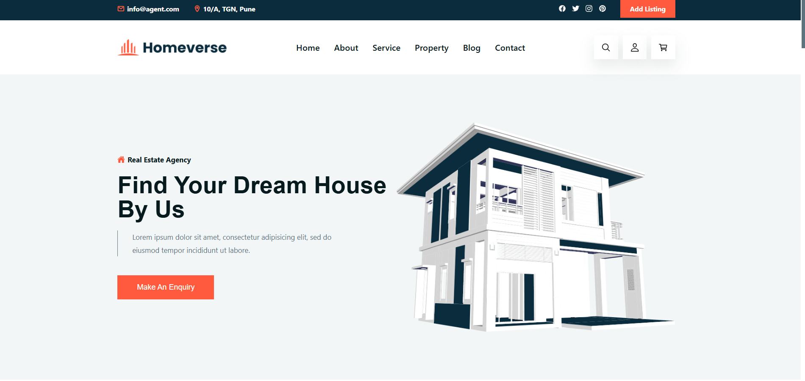
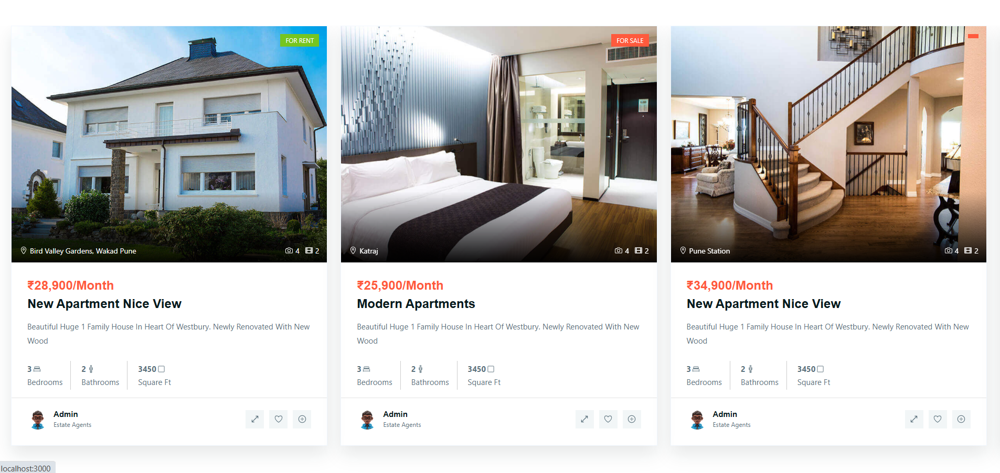

# 🏡 Real Estate Web Application

- A fully responsive Real Estate web application that enables users to explore properties for rent and sale across various locations. Built using React.js and styled with Tailwind CSS, this project emphasizes modern UI/UX and clean code practices.

## 🛠️ Tech Stack

- **Frontend**: React.js
- **Styling**: Tailwind CSS
- **Routing**: React Router
- **Icons**: React Icons
- **Animation**: AOS (Animate On Scroll)
- **Deployment**: Netlify

## ✨ Features

- 🔍 Filter properties by location, price, and type
- 🧭 Smooth scroll and animated UI
- 💡 Responsive design compatible with all screen sizes
- 🔗 External links to property sources
- 🔁 Reusable and clean components

## 📁 Project Structure

```bash
real-estate/
│
├── public/
├── src/
│ ├── assets/
│ ├── components/
│ ├── pages/
│ ├── App.js
│ ├── index.js
│ └── App.css
│
├── tailwind.config.js
├── postcss.config.js
└── package.json

```

### Installation

1. **Clone the repo**

```bash
   git clone https://github.com/Charudatta270104/real-estate.git

```

2. Navigate to the project directory

```bash
cd real-estate

```

3. Install dependencies

```bash
npm install
```

4. Run the app

```bash
npm start
```

## 📦 Deployment

This app is deployed on **Render**. You can deploy your own version by following these steps:

1. **Push your project to GitHub**  
   Make sure your React project is committed and pushed to a GitHub repository.

2. **Go to [Render Dashboard](https://render.com/)**  
   Log in or sign up, then click on **"New +" > "Static Site"**.

3. **Connect your GitHub account**  
   Authorize Render to access your repositories and select your React project (e.g., `real-estate`).

4. **Configure your deployment:**

   - **Name**: (Choose any name, e.g., `real-estate`)
   - **Branch**: `main` (or your default branch)
   - **Build Command**:
     ```
     npm run build
     ```
   - **Publish Directory**:
     ```
     build
     ```

5. **Click "Create Static Site"**  
   Render will automatically install dependencies, build your app, and deploy it.

6. **Access your app**  
   After deployment, you’ll get a public URL like:

## Screenshot





## [🚀 View Live Demo](https://real-estate-ij18.onrender.com/)
